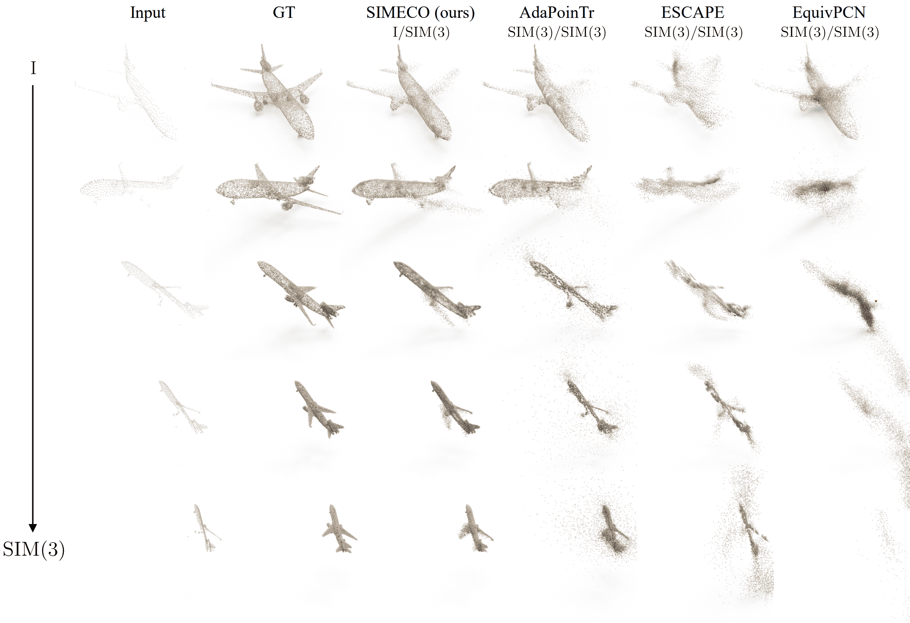
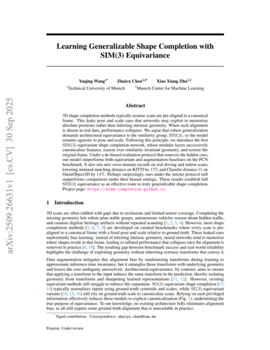

# SIMECO: SIM(3)-Equivariant Shape Completion

**NeurIPS 2025**

[](https://sime-completion.github.io)
[](https://arxiv.org/abs/2509.26631)
[](https://huggingface.co/)
[](https://colab.research.google.com/github/complete3d/simeco/blob/main/demo/demo.ipynb)
[](https://raw.githubusercontent.com/complete3d/simeco/main/LICENSE)

3D shape completion methods typically assume scans are pre-aligned to a canonical frame. When such alignment is absent in real data, performance collapses. SIMECO is a SIM(3)-equivariant network that delivers generalizable shape completion.

<p align="center">
  
</p>

## Getting Started with the Demo 🤹‍♂️

You can run the demo in one of two ways:

- **Google Colab** (Recommended): No installation needed; get started instantly in the cloud.
- **Local Linux**: Set up the environment locally for GPU-accelerated inference.

### Google Colab ☁️

[](https://colab.research.google.com/github/complete3d/simeco/blob/main/demo.ipynb)

To run the demo on Google Colab, simply click the badge above. Follow the instructions and execute the cells sequentially with a GPU instance. Please note that setting up the environment and installing dependencies will take about 1-2 minutes.

### Local Linux 🖥️

> [!NOTE]
A CUDA-enabled GPU is required for local inference.

1. Clone the repository:

   ```bash
   git clone https://github.com/submission13448/simeco.git && cd simeco && git lfs pull
   ```

2. Create a conda environment with all dependencies (this will take approximately 5 minutes):

   ```bash
   conda env create -f build/environment.yml && conda activate simeco
   ```

3. Run the inference code and choose the desired transformation mode (e.g., `sim3`, `translation`, `scale` or `rotation`). The results will be saved in the `data/result` directory.

   ```bash
   python inference.py --pc_file data/pc/2a05d684eeb9c1cfae2ca9bb680dd18b.npy --aug_mode sim3
   ```
---

## Full Runs 🏃

> [!IMPORTANT]  
> We're actively refactoring the codebase through December 2025. Expect occasional breaking changes.

If you have sufficient resources and want to train and evaluate SIMECO end-to-end, follow these steps:

### Extra Dependencies ⚙️

Install the dependencies:

   ```bash
   cd extensions/chamfer_dist
   python setup.py install
   ```

### Dataset 📂

We use the official PCN dataset. The directory structure should be:
```
│PCN/
├──train/
│  ├── complete
│  │   ├── 02691156
│  │   │   ├── 1a04e3eab45ca15dd86060f189eb133.pcd
│  │   │   ├── .......
│  │   ├── .......
│  ├── partial
│  │   ├── 02691156
│  │   │   ├── 1a04e3eab45ca15dd86060f189eb133
│  │   │   │   ├── 00.pcd
│  │   │   │   ├── 01.pcd
│  │   │   │   ├── .......
│  │   │   │   └── 07.pcd
│  │   │   ├── .......
│  │   ├── .......
├──test/
│  ├── complete
│  │   ├── .......
│  ├── partial
│  │   ├── .......
├──val/
│  ├── complete
│  │   ├── .......
│  ├── partial
│  │   ├── .......
├──PCN.json
└──category.txt
```

### Evaluation 📊

To evaluate a [pre-trained SIMECO model](./ckpt) using a single GPU:

```bash
bash ./scripts/test.sh <GPU_IDS> \
    --ckpts <path_to_checkpoint> \
    --config <path_to_config.yaml> \
    --exp_name <experiment_name>
```

Example:
```bash
bash ./scripts/test.sh 0 \
    --ckpts ckpt/checkpoint.pth \
    --config cfgs/SIMECO.yaml \
    --exp_name SIMECO
```

### Training 🏋️‍♀️

To train SIMECO from scratch, run with DDP or DP:

**DistributedDataParallel (DDP)** 
```bash
bash ./scripts/dist_train.sh <NUM_GPU> <port> \
    --config <config> \
    --exp_name <name> \
    [--resume] \
    [--start_ckpts <path>]
```

Example:
```bash
bash ./scripts/dist_train.sh 2 12345 \
    --config cfgs/SIMECO.yaml \
    --exp_name SIMECO 
```

**DataParallel (DP)** 
```bash
bash ./scripts/train.sh <GPUIDS> \
    --config <config> \
    --exp_name <name> \
    [--resume] \
    [--start_ckpts <path>]
```

Example:
```bash
bash ./scripts/train.sh 0 \
    --config cfgs/SIMECO.yaml \
    --exp_name SIMECO 
```

## 🎓 Citation

If you use SIMECO in a scientific work, please consider citing the paper:

<a href="https://arxiv.org/pdf/2509.26631"></a>
<a href="https://arxiv.org/pdf/2509.26631">[paper]</a>&nbsp;&nbsp;<a href="https://arxiv.org/abs/2509.26631">[arxiv]</a>&nbsp;&nbsp;<a href="./CITATION.bib">[bibtex]</a><br>
```bibtex
@article{wang2025simeco,
    title={Learning Generalizable Shape Completion with SIM(3) Equivariance}, 
    author={Yuqing Wang and Zhaiyu Chen and Xiao Xiang Zhu},
    journal={arXiv preprint arXiv:2509.26631},
    year={2025}
}
```
<br clear="left"/>

## 🙏 Acknowledgements

Part of our implementation is based on the [PoinTr](https://github.com/yuxumin/PoinTr) repository. We thank the authors for open-sourcing their great work.